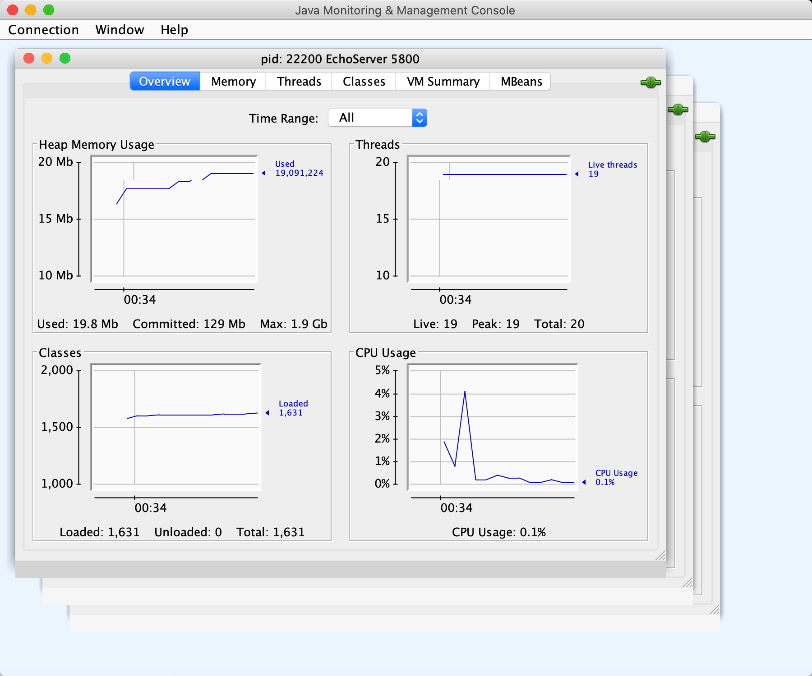
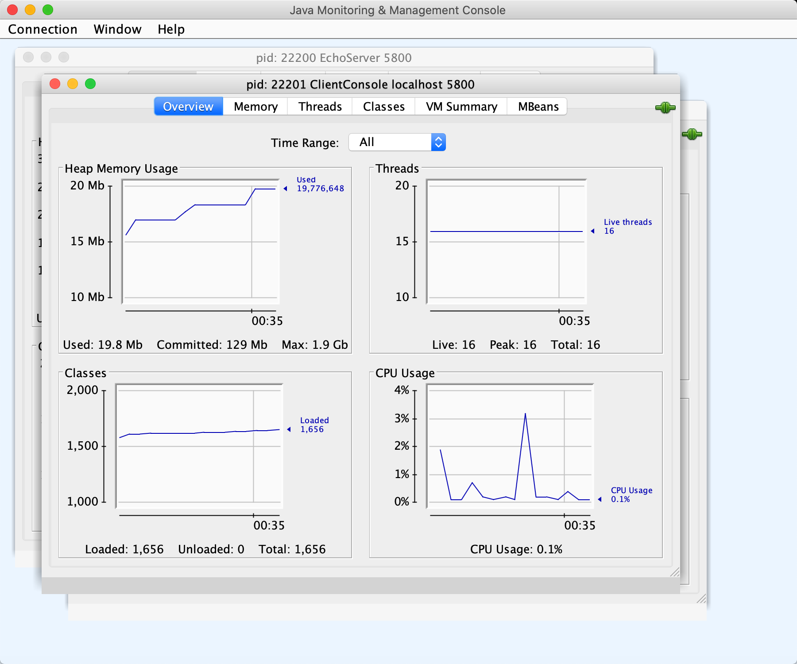
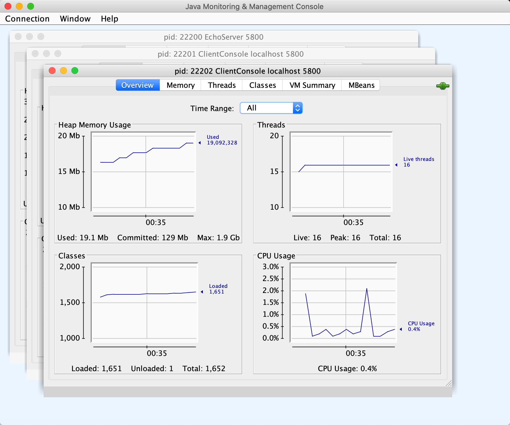
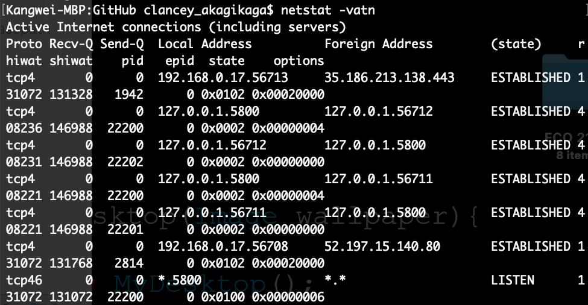
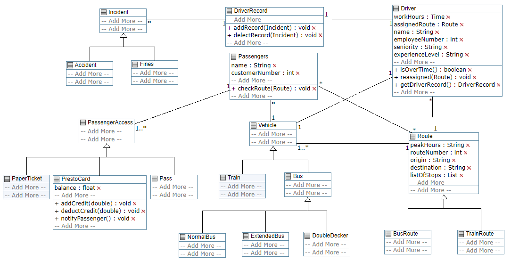
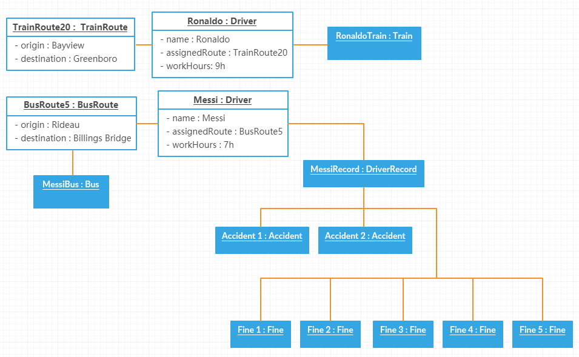

**Kangwei Liao**  
**#: 8568800**  
Github repository link: https://github.com/SEG2105-uottawa/seg2105-assignment2-KangweiLIAO  

# Part I
  
### Server Threads:
  
### Client 1 Threads:
  
### Client 2 Threads:
  
### netstat
  

# Part II
## Class Diagram  
  

## Object Diagram  

